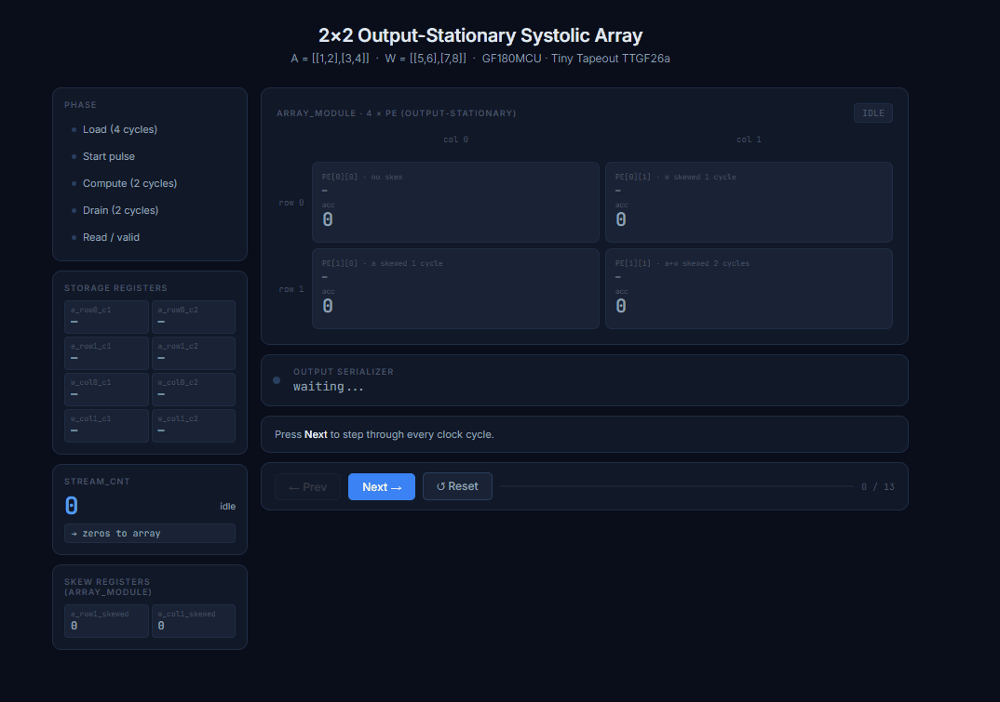
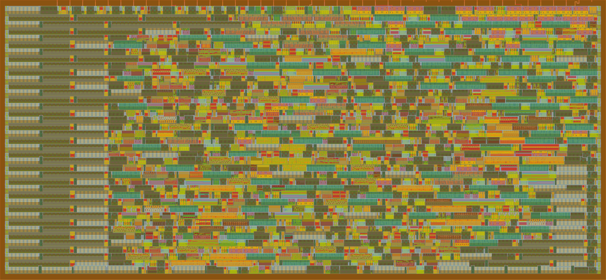

# 2×2 Output-Stationary Systolic Array

A synthesizable 2×2 systolic array for signed 4-bit matrix multiplication, designed for silicon tapeout on GF180MCU via [Tiny Tapeout](https://tinytapeout.com).

[](https://github.com/Irene-ux/tt-systolic-array-2x2/actions/workflows/gds.yaml)
[](https://github.com/Irene-ux/tt-systolic-array-2x2/actions/workflows/test.yaml)
[](https://github.com/Irene-ux/tt-systolic-array-2x2/actions/workflows/docs.yaml)



[▶ 3D Chip Viewer](https://gds-viewer.tinytapeout.com/?model=https://irene-ux.github.io/tt-systolic-array-2x2/tinytapeout.oas&pdk=gf180mcuD)

## What it does

Computes **C = A × W** for signed 4-bit integer matrices using an output-stationary dataflow. Each PE accumulates its result in place over two compute cycles. Inputs are pre-loaded via a serial register interface; the internal `stream_cnt` sequencer feeds values automatically after `start` is pulsed.

Multiply-accumulate uses **shift-and-add** instead of the `*` operator — a deliberate area optimisation that eliminates synthesised multipliers and keeps the design within the single-tile cell budget.

## Architecture

```
tt_um_systolic_array          TT wrapper
├── storage registers         8 registers, loaded in 4 cycles via ui_in / uio_in
├── stream_cnt sequencer      auto-feeds c1 → c2 → zeros after start
└── systolic_array
    ├── fsm                   IDLE → COMPUTE → DRAIN → READ
    ├── array_module
    │   ├── PE[0][0]          no skew
    │   ├── PE[0][1]          w_col1 skewed 1 cycle
    │   ├── PE[1][0]          a_row1 skewed 1 cycle
    │   └── PE[1][1]          a_row1 + w_col1 skewed 2 cycles
    └── output_serializer
```

## Pin interface

| Pin | Dir | Function |
|-----|-----|----------|
| `ui_in[0]` | in | `start` — begin computation |
| `ui_in[1]` | in | `load` — write to storage register |
| `ui_in[3:2]` | in | `sel` — register select (00 a_row0 · 01 a_row1 · 10 w_col0 · 11 w_col1) |
| `ui_in[7:4]` | in | `data_c1` — first element of selected row/col |
| `uio_in[7:4]` | in | `data_c2` — second element of selected row/col |
| `uo_out[7:0]` | out | serialised result bytes |
| `uio_out[0]` | out | `valid` — result ready |

## Usage

```
# 1. Load — 4 cycles with load=1
sel=00  ui_in[7:4]=a[0][0]  uio_in[7:4]=a[0][1]
sel=01  ui_in[7:4]=a[1][0]  uio_in[7:4]=a[1][1]
sel=10  ui_in[7:4]=w[0][0]  uio_in[7:4]=w[1][0]
sel=11  ui_in[7:4]=w[0][1]  uio_in[7:4]=w[1][1]

# 2. Compute — pulse start=1 for one cycle

# 3. Read — wait for uio_out[0]=1, then read uo_out
```

**Example:** A = [[1,2],[3,4]], W = [[1,2],[3,4]] → [[7,10],[15,22]]  
*(Inputs within signed 4-bit range: −8 to +7)*

## Implementation

| | |
|--|--|
| Process | GF180MCU 180 nm |
| Shuttle | Tiny Tapeout TTGF26a |
| Clock | 50 MHz |
| Data | Signed 4-bit in · 8-bit accumulator |
| Multiplier | Shift-and-add (no `*` operator) |

## Physical design metrics

| Metric | Value |
|--------|-------|
| Die area | 346.64 × 160.72 µm (55,712 µm²) |
| Core area | 51,967 µm² |
| Standard cells | 1,392 |
| Core utilisation | 52.5 % |
| Routed wirelength | 30,051 µm |
| Vias | 5,560 |
| Routing DRC errors | 0 |
| Antenna violations | 0 |
| Magic DRC errors | 0 |
| LVS errors | 0 |
| Setup slack (nom tt_025C_3v30) | +6.58 ns |
| Hold slack (nom tt_025C_3v30) | +1.00 ns |
| Total power | 3.45 mW |
| IR drop worst (VPWR) | 79.8 µV |

## Cell breakdown

| Class | Count |
|-------|-------|
| Sequential (flip-flops) | 110 |
| Combinational (multi-input) | 631 |
| Inverters | 86 |
| Timing repair buffers | 104 |
| Clock buffers | 19 |
| Tap cells | 348 |
| Fill cells | 1,545 |

## Verification

Cocotb testbenches for all 6 modules. All tests pass locally and in CI.

```bash
make TOPLEVEL=pe               MODULE=test_pe
make TOPLEVEL=array_module     MODULE=test_array_module
make TOPLEVEL=systolic_array   MODULE=test_systolic_array
```

## Layout



## Repository structure

```
src/
  pe.v                  Processing element (shift-and-add MAC)
  array_module.v        2×2 PE array with diagonal skewing
  fsm.v                 FSM controller
  output_serializer.v   Result serializer
  systolic_array.v      Top-level array
  tt_um_systolic_array.v  TT wrapper
test/                   cocotb testbenches
docs/                   Demo GIF and layout render
```

## Author

Irene · [GitHub](https://github.com/Irene-ux)
